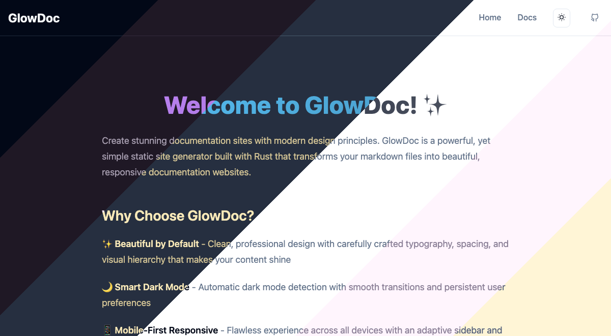

# GlowDoc

GlowDoc is a modern, lightweight documentation template that presents a beautiful thoughtful space for your work.  Built with HTML, CSS, and minimal JavaScript for fast loading and easy customization.



We have a hosted version of _these very docs_ on [github pages](https://paradise-runner.github.io/glowdoc/) for you to see how markdown can be transformed _very quickly_ and _beautifully_.

## Features

- ✨ **Modern Design** - Clean, professional appearance with beautiful typography
- 🌙 **Dark Mode** - Built-in theme switching with smooth transitions
- 📱 **Responsive** - Perfect on desktop, tablet, and mobile devices
- ⚡ **Fast** - Minimal dependencies and optimized performance
- ♿ **Accessible** - Built with accessibility best practices
- 🎨 **Customizable** - Easy to modify colors, fonts, and layout
- 📝 **Markdown Support** - Write documentation in Markdown files

## Quick Start

### Option 1: Use as Static HTML

1. Download or clone this repository
2. Open `index.html` in your browser
3. Start editing the content

### Option 2: Build from Markdown

1. Install Rust (if not already installed):

   ```bash
   curl --proto '=https' --tlsv1.2 -sSf https://sh.rustup.rs | sh
   ```

2. Edit markdown files in the `docs/` folder

3. Build the site:

   ```bash
   cargo run --release
   ```

4. Serve locally:
   ```bash
   python3 -m http.server 8000
   ```

## Documentation Structure

```
docs/
├── config.yaml                 # Navigation configuration
├── introduction/
│   ├── quick-start.md
│   └── what-is-glowdoc.md
├── getting-started/
│   ├── installation.md
│   ├── configuration.md
│   └── first-steps.md
├── customization/
│   ├── theming.md
│   ├── components.md
│   └── styling.md
└── advanced/
    ├── plugins.md
    ├── deployment.md
    └── api.md
```

## Configuration

### Auto-Generate Configuration

GlowDoc can automatically generate `docs/config.yaml` by scanning your documentation folder:

```bash
# Interactive configuration builder
cargo run init-config

# Or generate the current structure non-interactively
cargo run init-config \
   --title "GlowDoc" \
   --description "modern docs for the modern world" \
   --section-order introduction,getting-started,customization,advanced \
   --rename-page getting-started/installation.md="Installation" \
   --page-order introduction=what-is-glowdoc.md,quick-start.md \
   --page-order getting-started=installation.md,configuration.md,first-steps.md \
   --page-order customization=theming.md,components.md,styling.md \
   --page-order advanced=plugins.md,deployment.md,api.md
```

This command generates the exact config.yaml currently used by this project.

### Manual Configuration

Edit `docs/config.yaml` to customize:

- Site title and description
- Navigation structure
- Page organization

## Adding New Pages

1. Create a new markdown file in the appropriate folder
2. Add the page to `docs/config.yaml`
3. Run `cargo run --release` to regenerate the site

## Customization

### Colors

Modify CSS custom properties in the `:root` selector:

```css
:root {
  --primary: 222.2 47.4% 11.2%;
  --secondary: 210 40% 96%;
  --background: 0 0% 100%;
  --foreground: 222.2 84% 4.9%;
}
```

### Typography

Update the font-family in the body selector or add custom fonts.

## Deployment

GlowDoc works with any static hosting service:

- **GitHub Pages**: Push to `gh-pages` branch
- **Netlify**: Connect your repository
- **Vercel**: Deploy with zero configuration
- **Any Static Host**: Upload the built files

## Scripts

- `cargo run init-config` - Generate config.yaml from docs structure (interactive or CLI)
- `cargo run --release` - Build the site from markdown files
- `cargo build --release` - Compile the Rust binary
- `python3 -m http.server 8000` - Serve the current site

## License

Apache 2.0 License - feel free to use this template for your projects!
